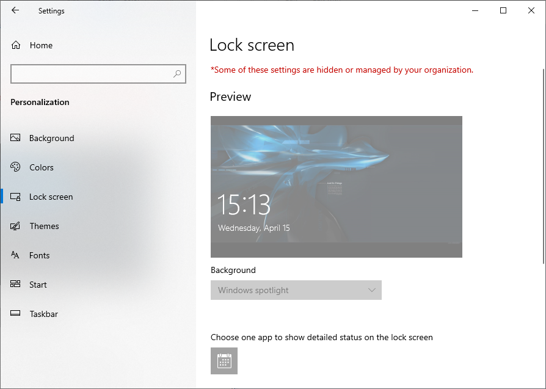
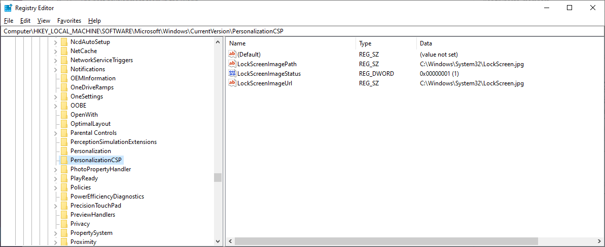

[](http://productivitytools.tech/)

[](http://productivitytools.tech/)
[](http://productivitytools.tech/)
[](http://productivitytools.tech/)
 
 <p align="right" width="20px">
    <a href="https://www.powershellgallery.com/packages/ProductivityTools.PSSetLockScreen/">
        
    </a>
    <a href="http://www.productivitytools.tech/sql-commands/">
        
    <a>
         <a href="https://github.com/pwujczyk/ProductivityTools.PSSetLockScreen">
        
    </a>
</p>


# Set-LockScreen


Module sets lock screen to chosen image. It also allows to change Lock screen if setting is managed by your company.
<!--more-->



```powershell
Set-LockScreen -ImagePath D:\OneDrive\InitPC\JustDoThings.png -Verbose
```


To install module use 

```powershell
Install-Module -Name ProductivityTools.PSSetLockScreen
```

Script adds new node to regedit **PersonalizationCSP** which contains information where to found image displayed on lock screen.



Script copy chosen image to **C:\Windows\System32** path.

Both actions required administrator permissions so you need to run PowerShell as administrator. 

### Dependencies:

Module depends on **ProductivityTools.PSTestIfAdmin**, which is installed automatically after invoking above command. 